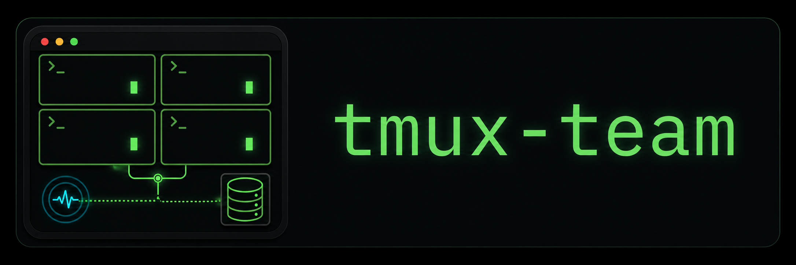

# tmux-team



`tmux-team` is a lightweight tmux control plane for persistent Codex agent teams.

It exists because plain `tmux send-keys` does not scale once several agents are active. Messages can collide with your own prompt, panes can be in copy mode, input can be cleared accidentally, and delivery is hard to verify.

`tmux-team` keeps the good part of tmux: every agent remains visible, interruptible, and human-operable. It moves coordination out of pane text and into durable state: database-backed messages, acknowledgments, app-server wakeups, scratchpad memory files, and sleep/resume snapshots.

Use it when a handful of Codex agents are working in parallel and plain tmux coordination starts breaking down: prompt collisions, `send-keys` races, copy-mode weirdness, lost messages, and too much manual routing.

## Install

Prerequisites: `tmux`, Codex CLI authenticated locally, and either `uv` or `pipx`.

Install the CLI from GitHub:

```bash
uv tool install git+https://github.com/PheelaV/tmux-team.git
# or
pipx install git+https://github.com/PheelaV/tmux-team.git
```

Install the Codex plugin/skill from the public marketplace metadata:

```bash
codex plugin marketplace add PheelaV/tmux-team --ref main
codex plugin add tmux-team@tmux-team
```

You can also add the marketplace from Codex and install through `/plugins install`.

The plugin installs the `start-tmux-team` skill. The CLI is still installed separately with `uv` or `pipx`; the plugin does not mutate global Python tools.

If the skill says `tmux-team` is missing, install the CLI with one of the commands above and retry.

Checkout fallback for the skill:

```bash
git clone https://github.com/PheelaV/tmux-team.git
cd tmux-team
make install-skill
```

## Getting Started: Fix A Failing Test

Start with a low-risk repo. The point is not to manually chat with four panes; give the orchestrator one durable goal and let roles pass work through the inbox.

```bash
cd /path/to/project
tmux new-session -s tt-my-project -c "$PWD"
codex
```

In that Codex control pane, ask:

```text
Use the start-tmux-team skill.

Goal:
Run the smallest failing test, route implementation work to the implementer,
and report the final test command and result. Keep changes inside this repo.
```

Equivalent direct command:

```bash
tmux-team bootstrap --project-root . --goal "Run the smallest failing test, route implementation work to the implementer, and report the final test command and result. Keep changes inside this repo."
```

If bootstrap is launched from inside tmux, it uses the current tmux session unless `--session` is provided. Otherwise it creates `tt-<project>` from the project directory name.

Bootstrap names the launcher window `tt-control`, starts a visible `tt-app-server` tmux window, opens remote Codex TUI panes in a tiled `tt-agents` window with `codex --cd <role-worktree> --remote ...`, waits for each TUI to create a loaded app-server thread, writes those discovered thread IDs and pane targets to `.tmux-team/team.toml`, queues the initial goal to `orchestrator`, and wakes the orchestrator with app-server `turn/start`. It does not type into any tmux prompt.

`--goal` and `--goal-file` seed only the initial operator message to `orchestrator`. Keep them to the objective, boundaries, and success criteria; the orchestrator should decompose that into scoped role inbox messages.

Each spawned role starts with a small tmux-team bootstrap prompt: load the `start-tmux-team` skill, read scratchpad memory, then claim inbox work or park. Scratchpads keep latest operational state near the top so context compression or pane restart does not erase the role's long-term goal.

Watch progress from the control pane:

```bash
tmux-team status
tmux-team status --verbose
tmux-team inbox list --role orchestrator
tmux-team inbox list --role implementer
tmux-team pane capture implementer --lines 80 --offset 0
tmux-team milestone list --today
```

Stop the managed team without killing your control pane:

```bash
tmux-team sleep
tmux-team resume
```

## How It Works

`tmux-team` is a small Python CLI backed by SQLite, TOML config, tmux windows, and Codex app-server remote TUI wake delivery.

If role agents need to message each other without stopping at Codex approval prompts, launch managed role panes with an explicit role execution policy:

```bash
tmux-team bootstrap --project-root . --role-profile tmux-team-role
tmux-team bootstrap --project-root . --role-yolo
```

`--role-profile` passes a named Codex profile to each managed role TUI. `--role-yolo` passes Codex `--dangerously-bypass-approvals-and-sandbox` to managed role TUIs only. Use YOLO mode only when the project/worktree is already the sandbox you accept for those agents.

Set role-specific Codex launch options when roles need different models, reasoning effort, or profiles:

```bash
tmux-team bootstrap \
  --project-root . \
  --role-model orchestrator=gpt-5.5 \
  --role-reasoning-effort orchestrator=xhigh \
  --role-model collector=gpt-5.5 \
  --role-reasoning-effort collector=high \
  --role-codex-profile implementer=tmux-team-role
```

For advanced Codex config, pass repeatable per-role `-c` overrides:

```bash
tmux-team bootstrap --project-root . --role-codex-config collector='model_reasoning_effort="high"'
```

The default agent layout is grouped:

```bash
tmux-team bootstrap --project-root . --agent-layout grouped
```

Use separate role windows only when you explicitly want that layout:

```bash
tmux-team bootstrap --project-root . --agent-layout separate-windows
```

Use per-role worktrees when roles need isolated checkout state:

```bash
tmux-team bootstrap \
  --project-root /repo/main \
  --roles orchestrator,implementer,collector,trainer \
  --role-worktree orchestrator=/repo/main \
  --role-worktree implementer=/repo/main \
  --role-worktree collector=/repo/main-collector \
  --role-worktree trainer=/repo/main-trainer \
  --allow-shared-worktree orchestrator,implementer
```

`project_root` remains the control/config root and the default role worktree. Each role with `--role-worktree ROLE=PATH` launches its Codex TUI with tmux `-c <path>` and Codex `--cd <path>`, and the generated `.tmux-team/team.toml` records `worktree = "..."` for the role.

To create missing worktrees before launch:

```bash
tmux-team bootstrap \
  --project-root /repo/main \
  --role-worktree collector=/repo/main-collector \
  --create-missing-worktrees \
  --worktree-base-ref HEAD
```

Bootstrap refuses explicitly mapped missing worktrees, non-git directories, dirty tracked files, and duplicated role worktrees unless allowed. Use `--allow-dirty-role ROLE` or `--allow-shared-worktree ROLE,ROLE` only when that is intentional.

Manual CLI operations are still available:

```bash
tmux-team init --name example-team --runtime-dir /tmp/tmux-team-example
tmux-team status
tmux-team send --to orchestrator --summary "test failed" --body-file report.md
tmux-team send --to collector --summary "Collect evidence" --body-file task.md --correlation-key issue-123
tmux-team broadcast --from orchestrator --summary "checkpoint" --body "Report status and blockers." --exclude orchestrator
tmux-team broadcast --from orchestrator --summary "collector check" --body "Report test status." --only collector
tmux-team broadcast --notice --summary "Policy updated" --body "Read current operating notes." --exclude orchestrator
tmux-team inbox next --role orchestrator --auto-ack
tmux-team inbox reclaimable --role orchestrator
tmux-team inbox ack <message-id> --role orchestrator
tmux-team inbox complete <message-id> --role orchestrator --summary "routed" --body-file result.md --reply-to-sender
tmux-team inbox complete-replies --role orchestrator
tmux-team watch start --role collector --summary "Monitor external run" --next-update-in 15m
tmux-team watch update <watch-id> --role collector --summary "Heartbeat ok" --next-update-in 15m
tmux-team watch complete <watch-id> --role collector --summary "Run terminalized"
tmux-team pane list --all
tmux-team pane capture collector --lines 120 --offset 40
tmux-team pane capture collector --summary --summary-lines 120
tmux-team watchdog
tmux-team ext list
tmux-team ext doctor
tmux-team sleep
tmux-team resume
```

`inbox next` claims one message. If a role is woken with multiple pending messages, it should claim, ack, do, and complete one message, then run `inbox next` again until there is no pending work. Expired claims are reclaimable through the same `inbox next` path and appear as `stale_claimed` in `status` and `inbox reclaimable`. Use `--summary` for the one-line result and optional `--body` or `--body-file` for detail. `--reply-to-sender` queues a completion note back to the original sender and wakes it when that sender is a managed role.

Completion replies are stored as `completion_notice` messages. After reading and acknowledging them, use `tmux-team inbox complete-replies --role ROLE` to close notice bookkeeping without writing a bespoke completion for each one.

Use `tmux-team status --verbose` when counts are not enough. It prints bounded active message summaries per role, including state, priority, sender, age, claim expiry, and summary. Claimed work that has not been acknowledged after the warning threshold appears with `warning=claimed_unacked`; tune that threshold with `--unacked-warn-seconds`.

Use `tmux-team inbox next --auto-ack` when a role wants claim and acknowledgement to be one step before it starts work.

Use `tmux-team watch` for long-running supervision that should not stay as an acknowledged inbox task for hours. Watches have their own heartbeat/update state and appear in `status --verbose` under the owning role. Use inbox messages for assignment and handoff; use watches for ongoing monitoring until a terminal condition is reached.

Use `--correlation-key`, `--related-to`, or `--supersedes` on `send`/`broadcast` when work belongs to a known thread. `tmux-team` warns when new active work for the same role matches an existing correlation key or normalized summary. The warning does not block delivery; pass `--allow-duplicate` when duplicate work is intentional. Use `inbox list --verbose` to inspect relation metadata.

Use `broadcast --notice` for durable announcements that should not create inbox work for each recipient. Notices are recorded as completed `notice` messages and can wake roles with a notice-only prompt; recipients do not claim, ack, or complete them.

`broadcast` is not a separate transport. It queues one normal message per recipient, so every recipient has its own message id, claim, ack, completion, and optional reply. By default it targets all configured roles except the sender. Use `--only` for a positive recipient filter or `--exclude` for a negative filter; they are mutually exclusive. `--to` remains a compatibility alias for `--only`.

`pane capture` reads tmux pane output for live supervision. Use `--lines` or `--limit` for how much history to print, and `--offset` to page back from the newest output. It is useful for the orchestrator or operator to inspect present progress that has not yet reached inbox completion or scratchpad memory. It must not be used as delivery confirmation; durable state still lives in SQLite messages, notifications, milestones, and memory.

Use `pane capture --summary` to ask `codex exec` for a compact structured summary of bounded pane output instead of dumping raw scrollback into the caller's context. The summary prompt is observation-only and does not treat pane text as delivery, acknowledgement, or completion proof.

`pane list --all` shows managed role panes and unmanaged panes in managed role windows. Use it before sleep/resume or layout repair when helper shells may be visually mixed into the team window.

`watchdog` runs built-in durable-state checks for urgent pending work, stale claims, claimed-but-unacked messages, old acknowledged tasks, and overdue watches. It reports findings without waking or mutating agents. Use `--interval-seconds` and `--max-iterations` when you want a simple local loop.

Role panes spawned by bootstrap are bound to team config and role. The startup prompt includes explicit `--role <role>` commands because Codex tool shells do not always inherit pane-local env, and shared worktrees make cwd inference ambiguous. Short commands such as `tmux-team memory show` and `tmux-team inbox next` are fine when role discovery works; otherwise keep the explicit `--role` flag from the startup prompt. Explicit `--config` remains available for operator scripts and ad-hoc control commands.

For Codex context resets, configure a `SessionStart` hook with matcher `startup|resume|clear|compact` that runs `tmux-team codex session-context`. That hook emits the same role contract as the initial startup prompt plus the current scratchpad excerpt, so it restores framework context without turning wake prompts into long instruction blocks.

Scratchpad memory is durable role state, not the queue. Use it for long-term goals, current task, blockers, boundaries, stable inputs, owned artifacts, and next action. Record only high-value durable updates near the top:

```bash
tmux-team memory show
tmux-team memory append --body "Active task: reproduce failing segment test; next action: run targeted pytest."
```

Use existing scratchpads during migration with `--role-memory ROLE=PATH`.

Do not append routine startup, parking, no-pending, command transcript, or "still waiting" notes. A practical threshold: append only when the update changes an active task, blocker, boundary, long-running job, final result, or next action; fold minor status facts into the next important update.

Milestones are the append-only operator timeline. Use them for broad state changes and results that answer "what happened today?" without reading every inbox message or pane transcript. By default, the operator/control plane and orchestrator record milestones; other roles report evidence through inbox completion and let the orchestrator decide what is milestone-worthy:

```bash
tmux-team milestone add --kind result --summary "Targeted test fixed and passed" --tag test
tmux-team milestone list --today
tmux-team milestone list --since -4h
```

Do not use milestones for command transcripts or routine chatter. Good milestone events include team start, task routing, evidence accepted, blocker found/resolved, tests passing, stable commit approval, sleep/resume, and team resize.

Config lives at `.tmux-team/team.toml` by default. Runtime state lives in the configured runtime directory and includes:

- `team.sqlite` for durable state;
- `events.jsonl` for append-only audit;
- `milestones.jsonl` for append-only operator milestones;
- `messages/*.md` for message bodies;
- `sleeps/*.toml` for operator-facing sleep/restart snapshots.

Persistent storage defaults to `.tmux-team/runtime`. Override it with `--runtime-dir`, `TMUX_TEAM_HOME`, or `[team].runtime_dir` in `.tmux-team/team.toml`; that is also the precedence order.

`tmux-team sleep` snapshots role state, pane targets, tmux session/window/pane IDs, and Codex app-server thread bindings before tearing down managed role/app-server windows. It leaves `tt-control` alive by default and marks active/draining roles paused so stale bindings do not receive new work. Use `tmux-team sleep --dry-run` to inspect the plan first.

`tmux-team resume` reads `.tmux-team/runtime/sleeps/latest.toml` by default, restarts the app-server when needed, recreates managed role panes, and launches each role with `codex resume <saved-session>` so the live Codex conversation is resumed instead of replaced by a fresh startup session. Use `tmux-team resume --dry-run` to inspect the planned tmux commands, `--snapshot PATH` for an older snapshot, and `--no-reactivate-roles` when resumed roles should stay paused.

Tmux notification uses `tmux display-message` by default. It does not type into the agent's prompt composer.

Wake-capable Codex delivery uses Codex app-server remote TUI mode. Bootstrap configures this automatically, but the manual form is:

```bash
codex app-server --listen ws://127.0.0.1:4500
codex --remote ws://127.0.0.1:4500
tmux-team codex bind implementer --endpoint ws://127.0.0.1:4500 --thread-id <thread-id>
tmux-team send --to implementer --summary "..." --body-file task.md --notify-method app-server-turn
```

`app-server-turn` submits a real Codex turn to the role's thread. The pane stays the live Codex UI, but `tmux-team` never types into the pane.

Project-local extensions live under `.tmux-team/extensions/<name>/extension.toml`. The first extension surface supports executable JSON hooks around message creation, claim, ack, completion, and notification operations. See [docs/extensions.md](docs/extensions.md).

## Tests

Unit tests:

```bash
make lint
make test
```

The unit suite includes a fake app-server WebSocket test for `app-server-turn` delivery.

Deterministic fake-agent smoke test:

```bash
make integration-test
make bootstrap-layout-smoke-test
make smoke-test
make congestion-smoke-test
```

`make integration-test` is the default local confidence suite. It runs Ruff, unit tests, the real tmux bootstrap/sleep layout smoke, the basic fake-agent workflow, and the congestion/multiple-message workflow.

Visible tmux run:

```bash
tmux new-session -s tt-sandbox -c "$PWD"
```

Then, from another terminal:

```bash
cd /path/to/tmux-team
uv run --with-editable . python scripts/sandbox_demo.py --session tt-sandbox --root /tmp/tmux-team-sandbox --force
```

Dockerized deterministic smoke test:

```bash
make docker-test
make docker-smoke-test
make docker-congestion-smoke-test
```

Opt-in real Codex integration:

```bash
TMUX_TEAM_RUN_CODEX=1 make codex-integration-test
```

The real Codex test uses `codex exec` against a disposable project. It is skipped unless `TMUX_TEAM_RUN_CODEX=1` is set because it requires auth, network, model availability, and a real model call.

Pro-friendly Docker filesystem pass-through:

```bash
TMUX_TEAM_RUN_CODEX=1 make codex-docker-fs-integration-test
```

This runs Codex on the host, using your normal local Codex auth, while Docker only sees the bind-mounted sandbox filesystem for final verification.

## Docs

Read the human docs before changing bootstrap or delivery behavior:

- [docs/index.md](docs/index.md)
- [docs/invariants.md](docs/invariants.md)
- [CONTRIBUTING.md](CONTRIBUTING.md)

Agent-facing design memory lives in [kb/00_index.md](kb/00_index.md).
