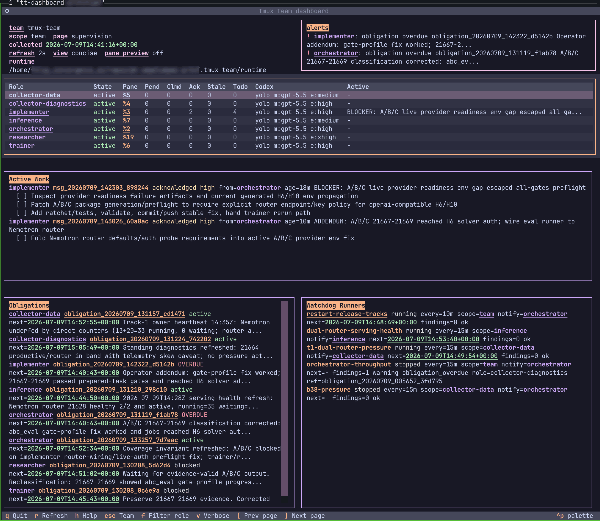

# tmux-team


`tmux-team` is a tiny tmux-native control plane for visible agent teams. Codex is the default built-in runtime.

Plain tmux is great until you have four agents: prompts collide, panes enter copy mode, messages disappear into scrollback, and nobody knows what is actually done.

`tmux-team` keeps the useful part of tmux: every agent remains visible, interruptible, and human-operable. It moves coordination out of pane text and into durable state: SQLite inboxes, ack/complete tracking, role-owned todos, obligations, scratchpad memory, structured wake delivery, milestones, watchdogs, and sleep/resume snapshots.

The bias is boring reliability: visible panes, explicit states, recoverable claims, and no terminal stdin as production transport.

## Feel The Magic

From a checkout, run the repeatable live demo:

```bash
make live-demo-setup
make live-demo-bootstrap
tmux attach -t tt-live-demo
make live-demo-verify
make live-demo-clean
```

The demo starts a visible Codex team, gives the orchestrator a failing test, routes implementation work, verifies the fix in a collector worktree, approves a stable commit, and exits with a clean inbox.

Run the same public-snapshot task through an external ACP TUI runtime with:

```bash
make live-demo-setup
TMUX_TEAM_RUN_LIVE_ACP=1 \
LIVE_DEMO_ACP_MODEL='<provider-model-and-options>' \
make live-demo-acp-cursor-bootstrap  # or: codex / claude / pool
tmux attach -t tt-live-demo
make live-demo-acp-start
make live-demo-sleep       # after role work completes
make live-demo-resume
make live-demo-verify
make live-demo-clean
```

The ACP path is provider-agnostic at the tmux-team boundary. Named Cursor, Codex, Claude, and Pool targets use their canonical
local adapters; `live-demo-acp-bootstrap` plus `LIVE_DEMO_ACP_AGENT_COMMAND` remains available for custom providers.

Expected shape:

```text
orchestrator: routed failing test to implementer
implementer: fixed regression and produced a commit
collector: verified the approved commit in a separate worktree
watchdog: no stale claims or overdue obligations
stable: approved commit recorded
verifier: LIVE DEMO VERIFY OK
```

## What This Is Not

`tmux-team` is not a general agent framework, a virtual office, or a hidden background daemon. It is a local control plane for a handful of visible coding agents working in tmux.

## What You Get

- Visible tmux panes for every role, plus a separate runtime-matched `tt-control` operator agent.
- Durable SQLite inboxes with claim, ack, complete, completion replies, and reclaimable stale work.
- Runtime-appropriate structured wake delivery: Codex app-server turns or ACP TUI control sockets, never production
  `tmux send-keys`.
- Per-role scratchpad memory for long-lived state and active-message todos for reset-safe substeps.
- Operator timelines, obligations, watchdog runners, pane capture, and an optional Textual dashboard.
- Sleep/resume snapshots so a team can stop and come back without losing role bindings or watchdog runners.



## Install

Default-runtime prerequisites: `tmux`, Codex CLI authenticated locally, and either `uv` or `pipx`.

Install the CLI from GitHub:

```bash
uv tool install git+https://github.com/PheelaV/tmux-team.git
# or
pipx install git+https://github.com/PheelaV/tmux-team.git
```

Install the optional Textual dashboard extra when you want the live operator dashboard:

```bash
uv tool install "tmux-team[dashboard] @ git+https://github.com/PheelaV/tmux-team.git"
# or
pipx install "tmux-team[dashboard] @ git+https://github.com/PheelaV/tmux-team.git"
```

The experimental external ACP TUI runtime uses Toad and requires Python 3.14. Base tmux-team and Codex operation
remain Python 3.11+. Until the Toad control-socket branch is released, install the temporary extra with:

```bash
uv tool install --python 3.14 "tmux-team[acp] @ git+https://github.com/PheelaV/tmux-team.git"
# or, from a checkout:
uv tool install --python 3.14 --force --editable ".[acp]"
```

### Runtime Setup Matrix

Install only the runtime and adapter you use. `tmux-team[acp]` supplies Toad transport; it does not install provider
CLIs, credentials, or every adapter.

| Runtime | Required local tools | Setup | tmux-team selection |
| --- | --- | --- | --- |
| Native Codex | `tmux`, [Codex CLI](https://developers.openai.com/codex/cli), tmux-team CLI/skill | Authenticate Codex locally | default; no ACP flags |
| Cursor ACP | Toad, [Cursor Agent](https://cursor.com/docs/cli/installation) | `agent login`; use project policy for autonomous commands | `--agent-runtime acp --acp-provider cursor` |
| Codex ACP | Toad, `@agentclientprotocol/codex-acp`, Codex CLI/auth | Install the Node adapter and authenticate Codex | `--agent-runtime acp --acp-provider codex` |
| Claude ACP | Toad, `@agentclientprotocol/claude-agent-acp`, Claude credentials | Install the Node adapter; authenticate Claude Code | `--agent-runtime acp --acp-provider claude` |
| Pool ACP | Toad, [Poolside Pool CLI](https://poolside.ai/get-started) | `pool login`, or configure Poolside API URL/key; `pool acp setup --editor ...` is not needed for Toad | `--agent-runtime acp --acp-provider pool` |

Pool discovers project skills under `.poolside/skills/` or `.agents/skills/` and global skills under
`~/.config/poolside/skills/`. Install the tmux-team skill globally with `make install-pool-skill`, or expose the same
`start-tmux-team` directory through one of the documented project locations.

Preflight the selected runtime before bootstrap:

```bash
toad --version
agent status  # Cursor
codex --version
claude --version
pool --version

# Install only the adapter(s) you use:
npm install -g @agentclientprotocol/codex-acp       # Codex
npm install -g @agentclientprotocol/claude-agent-acp  # Claude
```

Canonical provider presets are `cursor` -> `agent acp`, `codex` -> `codex-acp`, `claude` -> `claude-agent-acp`, and
`pool` -> `pool acp`. Codex ACP uses local Codex/ChatGPT or API-key authentication. Claude ACP runs the
official Claude Agent SDK and uses local Claude credentials and settings; it does not require an ACP URL. The ACP extra
installs Toad transport only; installation stays non-interactive and never selects or installs every provider adapter.

The tested runtime matrix is native Codex (the default), Cursor through native ACP, Codex through `codex-acp`, and
Claude through `claude-agent-acp`; Pool ACP uses the same canonical adapter boundary and deterministic test target.
ACP remains optional; native Codex does not require Toad or a provider adapter.

Startup instruction verbosity is configurable without changing the operating framework. Both profiles require every
spawned role to load the `start-tmux-team` skill and invariants:

```bash
tmux-team bootstrap --project-root . \
  --instruction-profile compact \
  --role-instruction-profile orchestrator=guided
```

Use `compact` for roles that follow a terse contract reliably and `guided` when a role benefits from the expanded loop.
Profiles are explicit configuration, not inferred from provider or model names, and are persisted for resume.

Use `agent --force acp` only for explicitly autonomous Cursor roles. For constrained roles, configure a project-local
`.cursor/cli.json` allowlist; tmux-team never edits the user's global provider policy. See
[External ACP TUI Runtime](docs/acp-runtime.md) for permission and worktree guidance.

Install the Codex plugin/skill from the public marketplace metadata:

```bash
codex plugin marketplace add PheelaV/tmux-team --ref main
codex plugin add tmux-team@tmux-team
```

You can also add the marketplace from Codex and install through `/plugins install`.

The plugin installs the `start-tmux-team` skill. The CLI is still installed separately with `uv` or `pipx`; the plugin does not mutate global Python tools.

If the skill says `tmux-team` is missing, install the CLI with one of the commands above and retry.

Checkout fallback for the skill:

```bash
git clone https://github.com/PheelaV/tmux-team.git
cd tmux-team
make install-skill
# or select one or more Agent Skills homes explicitly:
make install-skill SKILL_PROVIDERS=codex,cursor,claude,pool
make install-skill SKILL_PROVIDERS=all
```

The default is `codex`. Provider-specific destinations honor `CODEX_HOME`, `CURSOR_HOME`, `CLAUDE_HOME`,
`POOL_SKILLS_HOME`, and `XDG_CONFIG_HOME` where applicable. Installation is non-interactive and copies the same
canonical skill/invariants to every selected provider.

## Getting Started: Fix A Failing Test

Start with a low-risk repo. The point is not to manually chat with four panes; give the orchestrator one durable goal and let roles pass work through the inbox.

```bash
cd /path/to/project
tmux new-session -s tt-my-project -c "$PWD"
codex
```

In that Codex control pane, ask:

```text
Use the start-tmux-team skill.

Goal:
Run the smallest failing test, route implementation work to the implementer,
and report the final test command and result. Keep changes inside this repo.
```

Equivalent direct command:

```bash
tmux-team bootstrap --project-root . --goal "Run the smallest failing test, route implementation work to the implementer, and report the final test command and result. Keep changes inside this repo."
```

If bootstrap is launched from inside tmux, it uses the current tmux session unless `--session` is provided. Otherwise it creates `tt-<project>` from the project directory name.

Bootstrap names the launcher window `tt-control`, starts a visible `tt-app-server` tmux window, opens remote Codex TUI panes in a tiled `tt-agents` window with `codex --cd <role-worktree> --remote ...`, waits for each TUI to create a loaded app-server thread, writes those discovered thread IDs and pane targets to `.tmux-team/team.toml`, queues the initial goal to `orchestrator`, and wakes the orchestrator with app-server `turn/start`. It does not type into any tmux prompt.

`--goal` and `--goal-file` seed only the initial operator message to `orchestrator`. Keep them to the objective, boundaries, and success criteria; the orchestrator should decompose that into scoped role inbox messages.

Each spawned role starts with a small tmux-team bootstrap prompt: load the `start-tmux-team` skill, read scratchpad memory, then claim inbox work or park. Scratchpads keep latest operational state near the top so context compression or pane restart does not erase the role's long-term goal.

Watch progress from the control pane:

```bash
tmux-team status
tmux-team status --verbose
tmux-team inbox list --role orchestrator --state pending
tmux-team inbox list --role implementer
tmux-team pane capture implementer --lines 80 --offset 0
tmux-team milestone list --today
```

`--state pending` is the canonical read-only view of claimable work. It matches
the `pending=N` status count and includes queued, notified, retrying, and expired
claimed messages. Roles should still drain work with `inbox next`; a filtered
list is an observation surface, not the claim loop.

Stop the managed team without killing your control pane:

```bash
tmux-team sleep
tmux-team resume
```

## How It Works

`tmux-team` is a small Python CLI backed by SQLite, TOML config, and tmux windows. Codex roles use app-server wake
turns; experimental ACP roles use an external TUI control socket.

### Experimental External ACP TUI Roles

The ACP runtime launches one visible Toad TUI per role. Toad owns the ACP child command and session; tmux-team only
launches the TUI and sends compact prompts through its local control socket:

```bash
make install-skill SKILL_PROVIDERS=cursor

tmux-team bootstrap \
  --project-root . \
  --agent-runtime acp \
  --acp-tui-bin toad \
  --acp-provider cursor \
  --goal "Inspect the smallest failing test and report the result."
```

Use `--acp-provider codex` or `--acp-provider claude` to select their installed standard adapters. Pass
`--acp-agent-command` only for flags, `npx`, a pinned/local executable, or a custom provider.

Use repeatable `--acp-initial-config ID=VALUE` when the first model turn must use an explicit model, effort, fast mode,
or permission preset. tmux-team applies and confirms those provider-advertised options before sending startup prompts.

The tmux layout uses a Toad/ACP operator agent in `tt-control` plus visible role panes in `tt-agents`; there is no
`tt-app-server` window. The control agent is visible and interactive but is not a managed role and receives no role
inbox work. Each role gets a unique mode-`0600` Unix socket under the runtime directory. Bootstrap waits for Toad's
`ping`/`status` handshake before sending startup prompts.

Production wake delivery does not type into the pane:

```text
SQLite inbox -> private Unix socket -> visible Toad TUI -> ACP session/prompt -> provider agent
```

The socket carries only the compact wake; durable task bodies remain in SQLite. Provider-specific flags belong in
`--acp-agent-command`. For the three canonical providers, `--acp-provider` selects the standard command when no command
override is supplied; it remains provenance metadata for custom commands. Inspect or control a role with
`tmux-team acp status|wake|cancel <role>`.
ACP sleep/resume uses explicit `exact` or `handoff` policy and never silently opens a blank provider session.

Inspect or change options advertised by an idle live ACP session without
starting a new provider conversation:

```bash
tmux-team runtime options implementer
tmux-team runtime configure implementer \
  --set '<config-id>=<advertised-value>' \
  --set '<boolean-id>=true'
```

IDs and values come from the live Toad `configOptions` response; tmux-team has
no provider model catalog or hard-coded config IDs. Each confirmed response
replaces the complete stored `acp_config` map, updates model/effort/mode
summaries by ACP category, and records same-session lineage. A failed later
`--set` does not roll back earlier confirmed changes. These commands require a
Toad build with `configOptions`/`setConfig`; the temporary `tmux-team[acp]`
extra pins the compatible feature branch.

Switch an idle ACP role to a new provider/model session without changing panes
or losing durable work context:

```bash
tmux-team runtime prepare implementer \
  --summary "Focused fix passes; full verification remains."

tmux-team runtime switch implementer \
  --provider claude \
  --model sonnet \
  --handoff-file .tmux-team/runtime/handoffs/implementer/<handoff>.md
```

The handoff capsule contains bounded role, inbox, todo, memory, and Git state,
but never durable task bodies or a full transcript. The replacement Toad
process starts in the same tmux pane and receives a recovery prompt that points
to the durable capsule and current worktree. Inspect current and previous
provider sessions with `tmux-team runtime show <role>`.

See [External ACP TUI Runtime](docs/acp-runtime.md) for installation, constrained permissions, delivery mechanics,
provider handoffs, and current lifecycle limits.

If role agents need to message each other without stopping at Codex approval prompts, launch managed role panes with an explicit role execution policy:

```bash
tmux-team bootstrap --project-root . --role-profile tmux-team-role
tmux-team bootstrap --project-root . --role-yolo
```

`--role-profile` passes a named Codex profile to each managed role TUI. `--role-yolo` passes Codex `--dangerously-bypass-approvals-and-sandbox` to managed role TUIs only. Use YOLO mode only when the project/worktree is already the sandbox you accept for those agents.

Set role-specific Codex launch options when roles need different models, reasoning effort, or profiles:

```bash
tmux-team bootstrap \
  --project-root . \
  --role-model orchestrator=gpt-5.5 \
  --role-reasoning-effort orchestrator=xhigh \
  --role-model collector=gpt-5.5 \
  --role-reasoning-effort collector=high \
  --role-codex-profile implementer=tmux-team-role
```

For advanced Codex config, pass repeatable per-role `-c` overrides:

```bash
tmux-team bootstrap --project-root . --role-codex-config collector='model_reasoning_effort="high"'
```

Configured role Codex launch settings are recorded in `team.toml`, included in sleep snapshots, and replayed by `tmux-team resume`. Running watchdog runners are also reinstantiated on resume. If a host or tmux session ends before a graceful sleep, resume can build a recovery snapshot from `team.toml` and SQLite runtime state. Live TUI-only state that Codex does not expose, such as `/fast`, is reported as unknown; verify it manually after recovery if it matters.

Bootstrap and resume set tmux truecolor options on the managed session by default: `default-terminal` to `tmux-256color`, RGB terminal features when supported, and `COLORTERM=truecolor`. Use `--no-truecolor` only for unusual terminal stacks that mis-render color.

The default agent layout is grouped:

```bash
tmux-team bootstrap --project-root . --agent-layout grouped
```

Use separate role windows only when you explicitly want that layout:

```bash
tmux-team bootstrap --project-root . --agent-layout separate-windows
```

Use per-role worktrees when roles need isolated checkout state:

```bash
tmux-team bootstrap \
  --project-root /repo/main \
  --roles orchestrator,implementer,collector,trainer \
  --role-worktree orchestrator=/repo/main \
  --role-worktree implementer=/repo/main \
  --role-worktree collector=/repo/main-collector \
  --role-worktree trainer=/repo/main-trainer \
  --allow-shared-worktree orchestrator,implementer
```

`project_root` remains the control/config root and the default role worktree. Each role with `--role-worktree ROLE=PATH` launches its Codex TUI with tmux `-c <path>` and Codex `--cd <path>`, and the generated `.tmux-team/team.toml` records `worktree = "..."` for the role.

To create missing worktrees before launch:

```bash
tmux-team bootstrap \
  --project-root /repo/main \
  --role-worktree collector=/repo/main-collector \
  --create-missing-worktrees \
  --worktree-base-ref HEAD
```

Bootstrap refuses explicitly mapped missing worktrees, non-git directories, dirty tracked files, and duplicated role worktrees unless allowed. Use `--allow-dirty-role ROLE` or `--allow-shared-worktree ROLE,ROLE` only when that is intentional.

## Common Operations

After bootstrap, most operator work uses a small command set. Use the full [CLI Reference](docs/cli-reference.md) when you need less common flags.

```bash
tmux-team status --verbose
tmux-team dashboard --once --provenance
tmux-team send --to implementer --summary "Fix failing parser test" --body-file task.md
tmux-team inbox next --role orchestrator --auto-ack
tmux-team inbox complete <message-id> --role orchestrator --summary "routed" --reply-to-sender
tmux-team todo recover --role collector
tmux-team obligation start --role collector --summary "Monitor verification" --next-update-in 15m
tmux-team pane capture collector --lines 120 --offset 40
tmux-team watchdog
tmux-team watchdog run --once --delivery app-server-turn --notify-role orchestrator
tmux-team watchdog start --name default --interval 15m --notify-role orchestrator --delivery app-server-turn
tmux-team watchdog update default --interval 10m --goal "Escalate stale work"
tmux-team watchdog pause default --reason "blocked by prerequisite" --review-in 30m
tmux-team watchdog resume default
tmux-team milestone add --team --kind routing --summary "Team started"
tmux-team milestone list --today
tmux-team sleep
tmux-team resume
tmux-team operator bind --pane %0 --codex-thread-id <thread-id>
```

The optional live dashboard is optimized for an operator tmux split: work/supervision and context/history are separate pages, pane preview starts off by default, and local theme plus concise/verbose preferences are stored under `.tmux-team/runtime/dashboard_preferences.json`.

The important loop is durable and one-message-at-a-time:

```text
send -> app-server wake -> inbox next -> ack -> work -> complete -> optional reply-to-sender
```

Use scratchpad memory for long-lived role state, todos for active-message substeps, milestones for operator summaries, obligations for long-running commitments, and pane capture only for live observation. Pane text is never the source of truth for delivery or completion.

## Tests

Unit tests:

```bash
make lint
make test
```

The unit suite includes a fake app-server WebSocket test for `app-server-turn` delivery.

Deterministic fake-agent smoke test:

```bash
make integration-test
make bootstrap-layout-smoke-test
make smoke-test
make congestion-smoke-test
```

`make integration-test` is the default local confidence suite. It runs Ruff, unit tests, the real tmux bootstrap/sleep layout smoke, the basic fake-agent workflow, and the congestion/multiple-message workflow.

Visible tmux run:

```bash
tmux new-session -s tt-sandbox -c "$PWD"
```

Then, from another terminal:

```bash
cd /path/to/tmux-team
uv run --with-editable . python scripts/sandbox_demo.py --session tt-sandbox --root /tmp/tmux-team-sandbox --force
```

Dockerized deterministic smoke test:

```bash
make docker-test
make docker-smoke-test
make docker-congestion-smoke-test
```

Repeatable live Codex dogfood scenario:

```bash
make live-demo-setup
make live-demo-bootstrap
tmux attach -t tt-live-demo
make live-demo-verify
make live-demo-clean
```

The live demo clones a public snapshot, seeds a real failing test, opens the dashboard beside `tt-control`, and asks a
visible runtime-selected team to diagnose, fix, approve, and verify the change across separate role worktrees. It
remains a readable demo, but still includes the dashboard snapshot, sleep/resume, watchdog pressure, obligations,
milestones, stable approval, completion replies, notice broadcasts, correlation-key discipline, truecolor session
setup, and clean final inbox state. See [docs/live-demo.md](docs/live-demo.md).

Opt-in real Codex integration:

```bash
TMUX_TEAM_RUN_CODEX=1 make codex-integration-test
```

The real Codex test uses `codex exec` against a disposable project. It is skipped unless `TMUX_TEAM_RUN_CODEX=1` is set because it requires auth, network, model availability, and a real model call.

Pro-friendly Docker filesystem pass-through:

```bash
TMUX_TEAM_RUN_CODEX=1 make codex-docker-fs-integration-test
```

This runs Codex on the host, using your normal local Codex auth, while Docker only sees the bind-mounted sandbox filesystem for final verification.

## Docs

Read the human docs before changing bootstrap or delivery behavior:

- [docs/index.md](docs/index.md)
- [docs/invariants.md](docs/invariants.md)
- [CONTRIBUTING.md](CONTRIBUTING.md)

Agent-facing design memory lives in [kb/00_index.md](kb/00_index.md).
